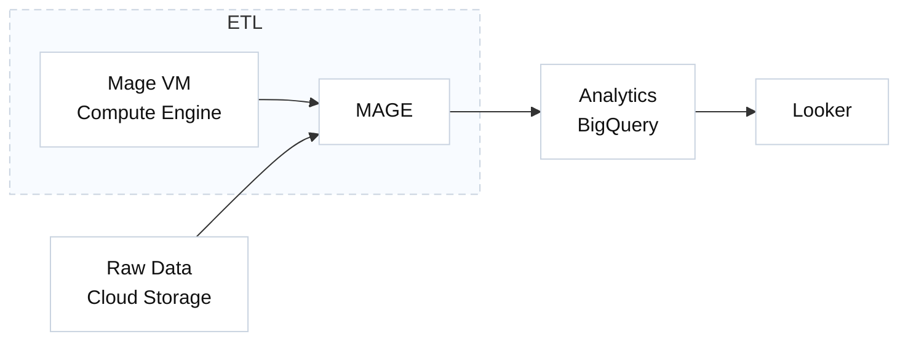

# Uber Data Engineering Pipeline

## Overview
This project builds an end-to-end data engineering pipeline for Uber data using Google Cloud Platform (GCP), Mage AI, BigQuery, and Looker. It ingests raw CSV data from Google Cloud Storage (GCS), processes it through an ETL pipeline, stores and analyses in BigQuery, and visualizes insights in Looker. 

---

## Tech Stack
- Google Cloud Storage (GCS) – Raw data storage
- Mage AI – Orchestration and ETL
- Google Compute Engine – Mage VM hosting
- BigQuery – Data warehouse for analytics
- Looker – Business intelligence dashboards
- Lucidchart – Data modeling

---

## Workflow

---

## Data Model

---

## SQL Analytics
BigQuery SQL script created to join the fact table with all relevant dimension tables  (datetime_dim, passenger_count_dim, trip_distance_dim, rate_code_dim, pickup_location_dim,  drop_location_dim, and payment_type_dim) to build an enriched analytics table.  
In addition, SQL analysis was performed on:
- Top 10 pickup locations based on the number of trips
- Total number of trips by passenger count
- Average fare amount by hour of the day
  
---

## Results / Analysis - Looker
Summary Metrics: Total Revenue: $1.6M, Total Records: 100K trips, Average Trip Distance: 3.0 miles, Average Fare Amount: $13.25, Average Tip Amount: $1.87

Revenue by Payment Type: Credit Card: Highest revenue share (~$1.25M), Cash: Second largest share, No Charge / Dispute: Minimal revenue

Revenue by Rate Code: Standard Rate: Dominant revenue source (~$1.5M), JFK & Newark rates: Moderate contribution, Negotiated Fare / Group Ride: Smaller share

Geographic Insights: Pick-up locations visualized on an interactive Looker map for trend analysis

---

  
